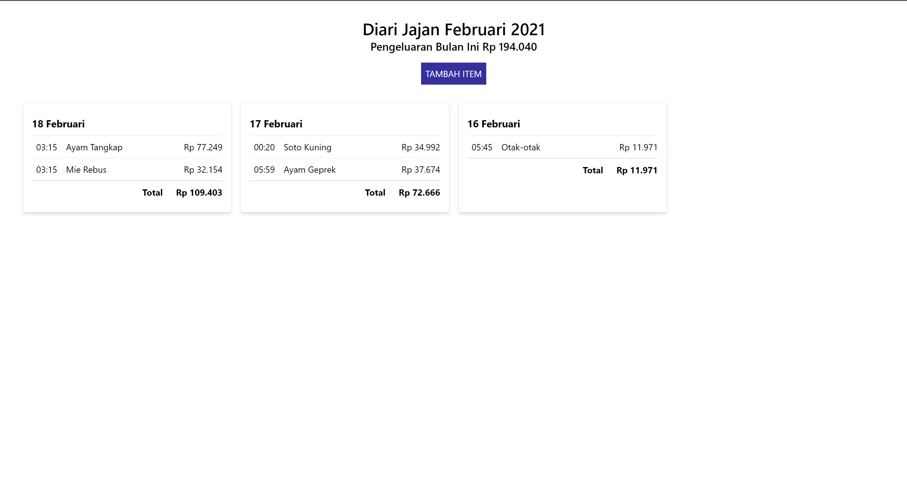

# Diari Jajan - Irfan Nurghiffari Muhajir

## About
This project is part of Kompas.id Frontend Developer test



## Getting Started

### Prerequisites
1. NodeJS & npm installed in your machine
2. Git installed

### How to Run
1. Clone repo to your local machine. After it finished, open the folder and install project dependencies. You can do this from your powershell/terminal :

```bash
# Clone this repository
git clone https://github.com/irfan44/fe-kompas-id-test.git
# Go to repository folder
cd fe-kompas-id-test
# Install dependencies
npm install
```

2. Run the json-server to serve our JSON data

```bash
npx json-server --id nama --watch items.json
```

3. Open another powershell/terminal. Run the app

```bash
npm run dev
```

4. Open `http://localhost:5173` to view the app in your browser